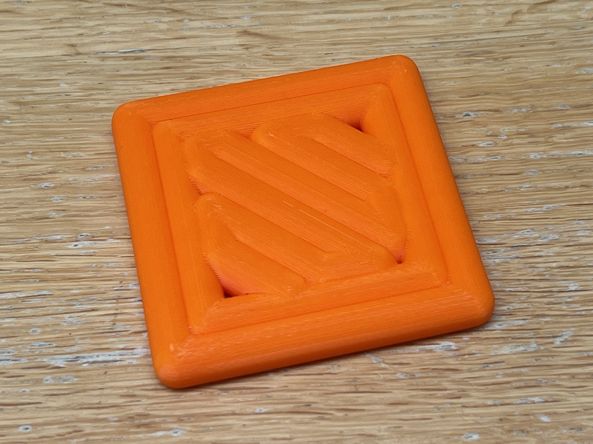
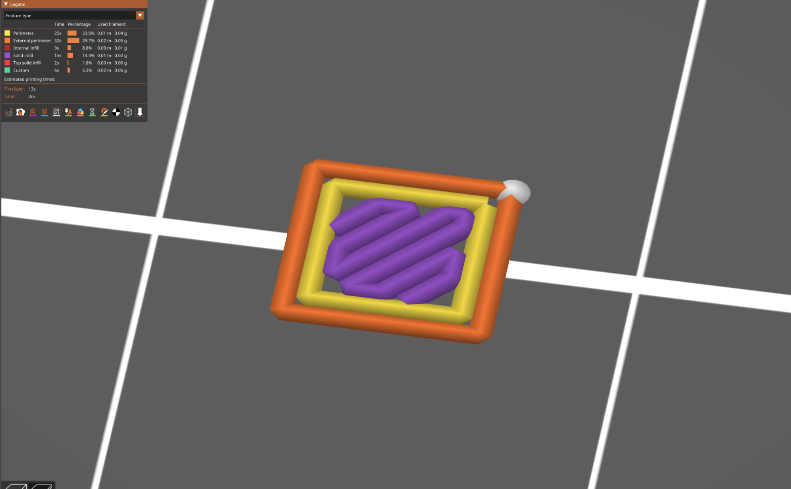

# First layer coaster

This model is a coaster, which looks like the first layer of a 3D print in progress.

I love watching my 3D printer at work, particularly the first layer. I love objects which are the "wrong" size. How could I combine the two?

I used PrusaSlicer 2.7.2 to slice a 2cm cube, parsed the G-code and created a model sixteen times bigger, using build123d.

You can see the external perimeter, the perimeter and the solid infill.

It's an easy print without supports. It might be worth using variable layer height.

https://www.printables.com/model/799684-first-layer-coaster

## License

CC0

## Author

Leon Brocard <acme@astray.com>
